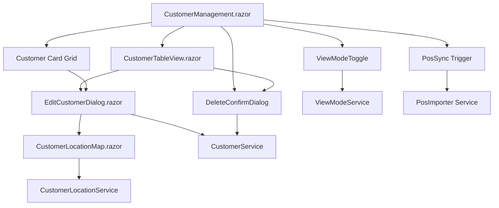

# Blazor Component Contracts

## CustomerManagement.razor (Enhanced)

### Properties
```csharp
[Parameter] public ViewMode InitialViewMode { get; set; } = ViewMode.Card;
[Parameter] public bool ShowDeletedCustomers { get; set; } = false;
[Parameter] public EventCallback<Customer> OnCustomerDeleted { get; set; }
```

### Methods
```csharp
// View mode switching
public async Task ToggleViewMode()
public async Task SetViewMode(ViewMode mode)

// Customer deletion
public async Task DeleteCustomer(Guid customerId, bool forceDelete = false)
public async Task<CustomerDeletionValidation> ValidateCustomerDeletion(Guid customerId)

// Location management
public async Task ShowCustomerLocation(Guid customerId)
public async Task UpdateCustomerLocation(Guid customerId, decimal latitude, decimal longitude)

// POS sync
public async Task TriggerPosSync(List<Guid>? customerIds = null)
```

### Events
```csharp
public event EventCallback<ViewMode> ViewModeChanged;
public event EventCallback<Customer> CustomerLocationUpdated;
public event EventCallback<PosSync> PosSyncCompleted;
```

## CustomerLocationMap.razor (New Component)

### Properties
```csharp
[Parameter] public Customer Customer { get; set; } = null!;
[Parameter] public bool ReadOnly { get; set; } = true;
[Parameter] public bool ShowAddressLookup { get; set; } = false;
[Parameter] public string GoogleMapsApiKey { get; set; } = string.Empty;
[Parameter] public EventCallback<CustomerLocationDto> OnLocationChanged { get; set; }
```

### Methods
```csharp
// Map interaction
public async Task InitializeMap()
public async Task UpdateMarker(decimal latitude, decimal longitude)
public async Task CenterMap(decimal latitude, decimal longitude)

// Location management
public async Task SetLocation(decimal latitude, decimal longitude)
public async Task ClearLocation()
```

### JavaScript Interop
```javascript
// Google Maps integration
window.customerMap = {
    initialize: (elementId, apiKey, lat, lng) => Promise<void>,
    updateMarker: (lat, lng) => Promise<void>,
    onClick: (callback) => void,
    setReadOnly: (readOnly) => void
};
```

## CustomerTableView.razor (New Component)

### Properties
```csharp
[Parameter] public List<Customer> Customers { get; set; } = new();
[Parameter] public bool ShowDeleted { get; set; } = false;
[Parameter] public bool AllowSelection { get; set; } = true;
[Parameter] public EventCallback<Customer> OnCustomerSelected { get; set; }
[Parameter] public EventCallback<Customer> OnCustomerEdit { get; set; }
[Parameter] public EventCallback<Customer> OnCustomerDelete { get; set; }
```

### Methods
```csharp
// Table management
public async Task SortBy(string column, bool ascending = true)
public async Task FilterBy(string searchTerm)
public async Task SelectCustomer(Customer customer)
public async Task SelectMultiple(List<Customer> customers)

// Bulk operations
public async Task BulkDelete(List<Customer> customers)
public async Task BulkPosSync(List<Customer> customers)
```

## EditCustomerDialog.razor (Enhanced)

### Properties
```csharp
[Parameter] public Customer? Customer { get; set; }
[Parameter] public bool ShowLocationFields { get; set; } = true;
[Parameter] public bool AllowLocationEdit { get; set; } = true;
[Parameter] public EventCallback<Customer> OnCustomerSaved { get; set; }
```

### Methods
```csharp
// Form validation
public async Task<bool> ValidateForm()
public async Task<List<string>> ValidateLocation(decimal? lat, decimal? lng)

// Location helpers
public async Task UseCurrentLocation()
public async Task ClearLocation()
public async Task OpenMapPicker()
```

## Component State Management

### ViewModeService (New Service)
```csharp
public interface IViewModeService
{
    Task<ViewMode> GetViewModeAsync();
    Task SetViewModeAsync(ViewMode mode);
    event EventCallback<ViewMode> ViewModeChanged;
}
```

### CustomerLocationService (New Service)
```csharp
public interface ICustomerLocationService
{
    Task<CustomerLocationDto?> GetLocationAsync(Guid customerId);
    Task<CustomerLocationDto> UpdateLocationAsync(CustomerLocationDto location);
    Task DeleteLocationAsync(Guid customerId);
    Task<bool> ValidateCoordinatesAsync(decimal latitude, decimal longitude);
}
```

### Component Integration Flow



## Error Handling Contracts

### Component Error States
```csharp
public enum CustomerComponentError
{
    LocationServiceUnavailable,
    GoogleMapsLoadFailed,
    InvalidCoordinates,
    DeletionBlocked,
    PosSyncFailed,
    ValidationFailed
}
```

### Error Display Component
```csharp
// CustomerErrorDisplay.razor
[Parameter] public CustomerComponentError ErrorType { get; set; }
[Parameter] public string? ErrorMessage { get; set; }
[Parameter] public bool ShowRetry { get; set; } = true;
[Parameter] public EventCallback OnRetry { get; set; }
```